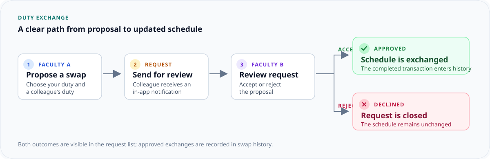

# Faculty Duty Swap Management System

A browser-based application for managing faculty duty schedules, peer-to-peer duty exchanges, notifications, and administrative reporting. The demo is configured for RGM College of Engineering & Technology and includes faculty and administrator views.

## Features

- **Faculty dashboard:** Review today's and upcoming duties, pending requests, and completed swaps.
- **Duty scheduling:** View duties in personal and institutional schedule views; create, update, and manage assignments.
- **Peer duty swaps:** Select duties and a colleague, submit an exchange request, and accept or reject requests received from colleagues.
- **Schedule and swap history:** Track schedule changes and review recorded swap outcomes.
- **Notifications:** See duty and swap activity and mark notifications as read.
- **Administration:** Manage faculty profiles and duties, review swap activity, configure college settings, and view college-wide dashboards.
- **Reports:** Filter duty data and export it as CSV or print a report.
- **Responsive interface:** Use the faculty and admin portals on desktop and mobile screens.

## Swap Workflow



## Technology

- React 19
- TypeScript
- Vite
- Tailwind CSS 4
- Lucide icons

## Run Locally

**Prerequisite:** Node.js with npm.

```bash
npm install
npm run dev
```

Open the local URL printed by Vite (the development server is configured to use port `3000`). No Gemini API key or backend service is required to run the current application.

### Other Commands

```bash
npm run build    # Create a production build in dist/
npm run preview  # Preview the production build locally
npm run lint     # Run the TypeScript check (tsc --noEmit)
```

## Demo Accounts

The application starts with the Dr. Rajesh Kumar faculty persona. The login form also supports these seeded profiles; the password input is presentational and is not checked by the demo.

| Role | Email | Password field value |
| --- | --- | --- |
| Faculty A | `faculty@rgmcet.edu.in` | `faculty123` |
| Faculty B | `priya.sharma@rgmcet.edu.in` | `faculty123` |
| Administrator | `admin@rgmcet.edu.in` | `admin123` |

The navigation includes a demo account switcher to move between these personas while testing a swap request and its approval.

## Data and Security Notes

This is a front-end demonstration, not a production deployment. Profiles, duties, swap requests, history, notifications, and settings are stored in the browser's `localStorage`; changes are local to that browser and are not synchronized to a server. Authentication is simulated using seeded profiles, passwords are not verified, and there is no server-side authorization. Do not use real credentials or sensitive institutional data. The administrator settings page can reset the demo data.

## Project Structure

```text
src/
  components/  Reusable UI, dialogs, navigation, and status elements
  context/     Authentication, application data, and toast state
  pages/       Faculty and administrator screens
  services/    Browser storage and demo data
  types/       Shared TypeScript models
```
